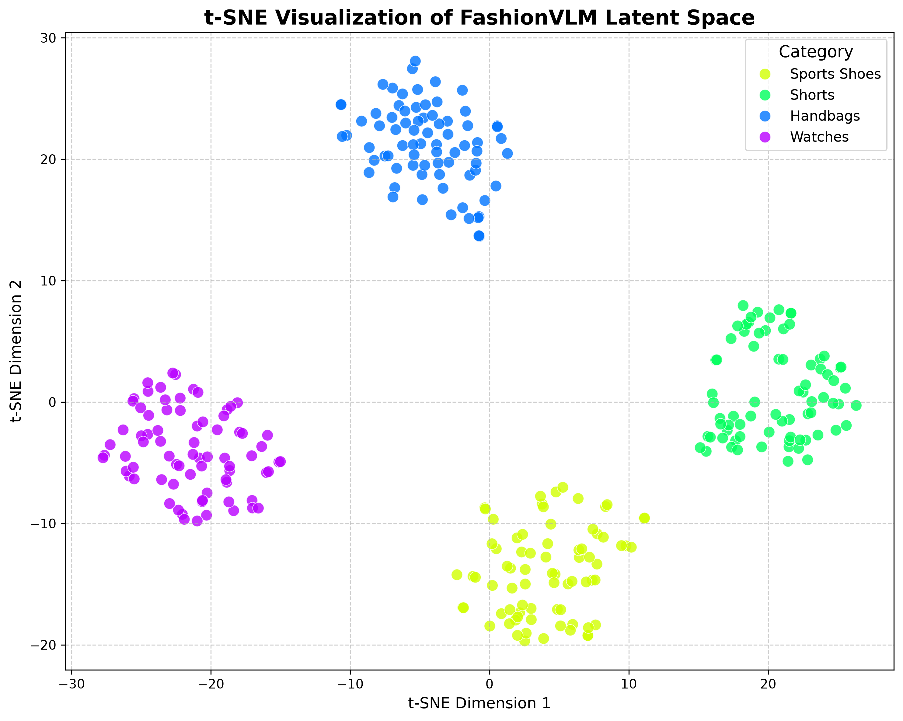
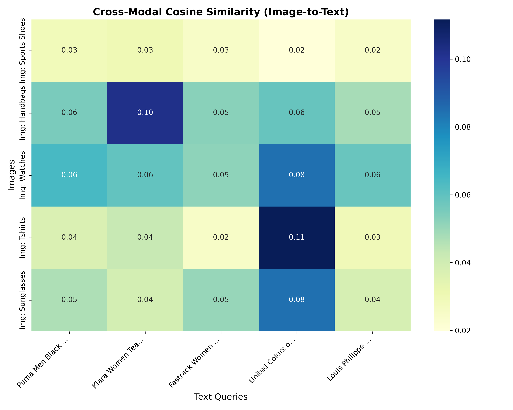
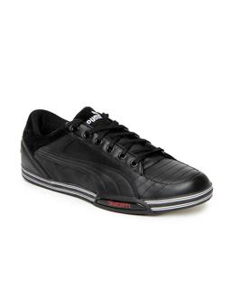
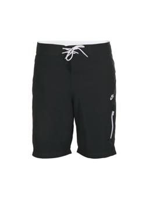

<div align="center">
  <h1>👕 FashionVLM: Enhancing Multimodal Fashion Classification</h1>
  <h3><i>Disentangled Learning Rates & Hard-Negative Contrastive Optimization on SigLIP2</i></h3>
  
  [](https://opensource.org/licenses/MIT)
  [](https://www.python.org/)
  [](https://pytorch.org/)
</div>

<br>

**Official Repository for the Paper:** *"Enhancing Multimodal Fashion Classification Through Disentangled Learning Rates and Hard-Negative Contrastive Optimization"*  
**Author:** Ngo Van Minh (Dai Nam University)

## 📌 The Challenge & Our Approach
Fine-tuning massive Vision-Language Models (VLMs) on fine-grained domains like e-commerce fashion often leads to **catastrophic forgetting** and **representation collapse**. Generic contrastive loss functions fail to distinguish between highly similar intra-category items (e.g., a *"red floral dress"* vs. a *"red polka-dot dress"*).

**FashionVLM** solves this by heavily optimizing the computationally efficient **SigLIP2 Base** architecture with two novel algorithmic interventions:
1. **Disentangled Learning Rate Dynamics:** Asymmetric optimization where the text encoder learns 10x slower than the vision encoder ($\eta_{text} = 10^{-6} \ll \eta_{vision} = 10^{-5}$). This preserves foundational linguistic grammar while aggressively adapting to new visual textures.
2. **Category-Aware Hard-Negative Penalty:** A dynamic mathematical penalty ($\gamma = 0.25$) applied to negative pairs within the identical category, forcing the latent space to capture subtle discriminative features.

---

## 🧠 Visual Evidence & Latent Space Analysis

### 1. Fine-Grained Latent Clustering (t-SNE)
Our hard-negative optimization forces the vision encoder to map fine-grained visual attributes into highly discriminative regions, rather than collapsing into a generic manifold. As seen below, categories like *Watches, Handbags, and Sports Shoes* are perfectly separated.
<p align="center">
  
</p>

### 2. Cross-Modal Alignment (Cosine Similarity)
Testing the model on diverse queries yields a razor-sharp similarity diagonal, proving that FashionVLM successfully maps specific textual adjectives to precise visual patches.
<p align="center">
  
</p>

### 3. Solving "In-the-Wild" Ambiguity
Baseline generic models frequently misclassify dark-colored items by relying on simple color-histogram proximity. FashionVLM isolates textual clues (e.g., *"textured rubber outsole with patterned grooves"*) to retrieve the exact semantic match.
<p align="center">
  
  &nbsp; &nbsp; &nbsp; &nbsp;
  
</p>

---

## 📊 Quantitative Results

Evaluated on the complex Kaggle Fashion Product dataset (4,337 cross-modal pairs across 73 granular categories), our $\sim$150M parameter model completely outperforms architectures nearly 3x its size.

| Architecture | Strategy | Params | Standard R@1 | Within-Cat R@1 | Peak VRAM |
| :--- | :--- | :---: | :---: | :---: | :---: |
| CLIP ViT-L/14 | Fine-Tuned | 427M | 33.03% | - | ~1.07 GiB |
| EVA02-L/14 | Fine-Tuned | 427M | 36.11%*| - | ~1.10 GiB |
| **SigLIP2 Base** | Zero-Shot | ~150M | 36.36% | 39.10% | ~0.35 GiB |
| **FashionVLM (Ours)**| **Disentangled + Hard-Neg**| **~150M** | **38.97%** | **41.11%** | **~0.35 GiB** |

*(EVA02-L/14 suffered from representation collapse during fine-tuning, plateauing at zero-shot metrics).*

---

## 🚀 Getting Started

### 1. Setup Environment
```bash
git clone https://github.com/Ngo-Miingg/FashionVLM.git
cd FashionVLM
pip install -r requirements.txt
```

### 2. Run Feature Visualization
```bash
python scripts/generate_tsne.py
python scripts/generate_heatmap.py
```

---

## 📖 Citation
If you find this codebase or our methodologies useful for your research, please cite:
```bibtex
@inproceedings{ngo2026fashionvlm,
  title={Enhancing Multimodal Fashion Classification Through Disentangled Learning Rates and Hard-Negative Contrastive Optimization},
  author={Ngo Van Minh},
  booktitle={Under Review},
  year={2026}
}
```